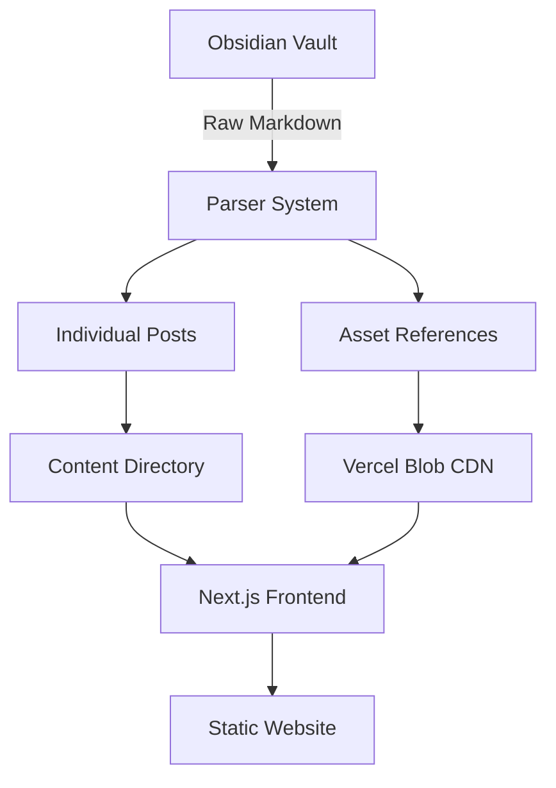

# Studio Log Generator

A powerful system that converts Obsidian vault studio logs into a beautiful, fast Next.js website with smart asset management via Vercel Blob storage.

## 🏗️ System Architecture

This project consists of three main components that work together:

### 1. **Parser System** (Python)
- **`parser.py`** - Core parser that splits studio log files by H1 headers into individual posts
- **`blob_parser.py`** - Smart asset manager that uploads only referenced assets to Vercel Blob
- **`blob_parser_with_compression.py`** - Enhanced version with video compression capabilities

### 2. **Asset Management** (Vercel Blob)
- Scans markdown files to find asset references (`_assets/...`)
- Uploads only referenced assets to Vercel Blob CDN
- Replaces local paths with CDN URLs in markdown files
- Intelligent caching to avoid re-uploading unchanged files

### 3. **Next.js Frontend** (React/TypeScript)
- Server-side rendered blog with dynamic routing
- Custom markdown renderer with syntax highlighting
- Post navigation and responsive design
- Static generation for optimal performance

## 🔄 How It Works



### Step-by-Step Process

1. **Content Creation**: Write studio logs in Obsidian with H1 headers for each entry
2. **Parsing**: `parser.py` splits long-form logs into individual posts by date/title
3. **Asset Detection**: System scans for image/video references in markdown
4. **Asset Upload**: `blob_parser.py` uploads referenced assets to Vercel Blob
5. **URL Replacement**: Local asset paths replaced with CDN URLs
6. **Frontend Build**: Next.js generates static pages from parsed content
7. **Deployment**: Site deployed with optimized assets served globally

## 🚀 Getting Started

### Prerequisites

- Node.js 18+ and npm
- Python 3.8+ with pip
- Vercel account with Blob storage
- Obsidian vault with studio log files

### 1. Setup Environment

```bash
# Install Node.js dependencies
npm install

# Create Python virtual environment
python -m venv venv
source venv/bin/activate  # On Windows: venv\Scripts\activate

# Install Python dependencies (if requirements.txt exists)
pip install requests hashlib pathlib markdown
```

### 2. Configure Vercel Blob

```bash
# Set your Vercel Blob token
export BLOB_READ_WRITE_TOKEN=vercel_blob_rw_xxxxx

# Test the connection
npm run test-blob
```

### 3. Parse Content

```bash
# Parse Obsidian files into individual posts
python parser.py

# Upload assets and update markdown with CDN URLs
npm run upload-assets
```

### 4. Run Development Server

```bash
npm run dev
```

Visit [http://localhost:3000](http://localhost:3000) to see your studio log.

## 📁 Project Structure

```
studio-log-nextjs/
├── 📂 src/
│   ├── 📂 app/
│   │   ├── page.tsx              # Homepage with post list
│   │   ├── [slug]/page.tsx       # Dynamic post pages
│   │   └── layout.tsx            # Site layout
│   ├── 📂 components/
│   │   ├── PostList.tsx          # Post listing component
│   │   ├── MarkdownRenderer.tsx  # Custom markdown renderer
│   │   └── CodeBlock.tsx         # Syntax highlighted code blocks
│   ├── 📂 lib/
│   │   ├── posts.ts              # Post loading utilities
│   │   ├── parser.ts             # TypeScript parser interface
│   │   └── config.ts             # Site configuration
│   └── 📂 types/
│       └── post.ts               # TypeScript interfaces
├── 📂 content/                   # Generated markdown posts
├── 📂 public/                    # Static assets (local fallback)
├── 🐍 parser.py                  # Main content parser
├── 🐍 blob_parser.py             # Asset upload manager
├── 📄 blob_cache.json            # Upload cache (auto-generated)
└── 📋 package.json               # Scripts and dependencies
```

## 🛠️ Available Scripts

### Content Management
- **`python parser.py`** - Parse Obsidian vault into individual posts
- **`npm run upload-assets`** - Upload referenced assets to Vercel Blob
- **`npm run upload-assets-basic`** - Basic asset upload without compression

### Development
- **`npm run dev`** - Start development server with Turbopack
- **`npm run build`** - Build for production
- **`npm run start`** - Start production server
- **`npm run lint`** - Run ESLint

### Deployment
- **`npm run deploy`** - Full deploy (upload assets + build + deploy to production)
- **`npm run deploy:preview`** - Deploy preview version

### Utilities
- **`npm run compress-videos`** - Compress video files for web
- **`npm run test-blob`** - Test Vercel Blob connection

## 🎯 Key Features

### Smart Asset Management
- **Selective Upload**: Only uploads assets actually referenced in markdown
- **Intelligent Caching**: Avoids re-uploading unchanged files using MD5 hashes
- **Multiple Formats**: Supports images, videos, PDFs, and other file types
- **Global CDN**: Assets served from Vercel's edge network worldwide

### Flexible Content Parser
- **Date Recognition**: Parses multiple date formats (MM-DD-YYYY, Month DD, YYYY, etc.)
- **Title Extraction**: Handles posts with and without titles
- **Asset Detection**: Finds references in both Markdown and HTML formats
- **Slug Generation**: Creates SEO-friendly URLs automatically

### Modern Frontend
- **Server-Side Rendering**: Fast initial page loads
- **Static Generation**: Pre-renders pages for optimal performance  
- **Responsive Design**: Works beautifully on all devices
- **Syntax Highlighting**: Code blocks with language detection
- **Navigation**: Previous/next post navigation

## 🔧 Configuration

### Site Settings
Edit `src/lib/config.ts`:
```typescript
export const siteConfig = {
  siteName: "Studio Log",
  contentDir: "content",
  indexPostsLimit: 10
}
```

### Parser Settings
Modify date formats and parsing rules in `parser.py`:
```python
DATE_FORMATS = [
    '%m-%d-%Y',
    '%m/%d/%Y', 
    '%Y-%m-%d',
    '%B %d, %Y',
    '%b %d, %Y'
]
```

## 📝 Content Format

Your Obsidian studio log files should follow this format:

```markdown
# 6-11-2024 — Project Update
Working on the new feature today. Made good progress on the UI components.


# 6-12-2024 — Bug Fixes  
Fixed the authentication issue and deployed the hotfix.

<video src="_assets/demo-video.mp4" controls></video>

# 6-13-2024
Quick update on yesterday's work. Everything looks good.
```

Each H1 header creates a new post. The parser handles:
- **Date-only headers**: `# 6-11-2024`
- **Date with title**: `# 6-11-2024 — Project Update`
- **Multiple date formats**: MM-DD-YYYY, Month DD YYYY, etc.

## 🌐 Deployment

### Vercel (Recommended)
```bash
# Deploy to production
npm run deploy

# Deploy preview
npm run deploy:preview
```

### Manual Deployment
```bash
# Build the application
npm run build

# Upload the .next/static and content to your hosting provider
```

## 💡 Benefits

- **Cost Effective**: Vercel Blob ($23/month for 1TB) vs Git LFS ($100/month)
- **Performance**: Global CDN with automatic optimization
- **Developer Experience**: Simple workflow from Obsidian to web
- **Scalability**: Handles large assets without bloating the repository
- **SEO Friendly**: Server-side rendering and semantic URLs

## 🔍 Troubleshooting

### Common Issues

**Asset upload fails:**
```bash
# Check your Vercel Blob token
echo $BLOB_READ_WRITE_TOKEN

# Clear cache and retry
rm blob_cache.json
npm run upload-assets
```

**Parser doesn't find posts:**
- Check that your markdown files contain H1 headers (`# Date`)
- Verify the date format matches one of the supported formats
- Ensure files are in the correct directory path

**Development server errors:**
```bash
# Clear Next.js cache
rm -rf .next
npm run dev
```

## 🤝 Contributing

1. Fork the repository
2. Create your feature branch
3. Test your changes locally
4. Submit a pull request

## 📄 License

This is a personal studio log generator. Feel free to adapt it for your own use!
